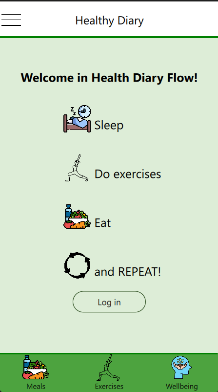

<!---->
# Habit Flow Diary App
## Objective
This project encompasses one key component:
1. **Health Tracking Application**: A user-friendly app that allows individuals to record essential health-related data.

## Key results
### **Health Tracking Application**
Below is an overview of the main components currently available in the app, along with their development status.

| App Components | Description | Status | 
| ----------- | ----------- | ----------- |
| Exercise Module | Track daily physical activities. | Done |
| Meals Module | Log daily meals and drinks consumed. | Done |
| Everyday Wellbeing Module | Monitor overall well-being on a daily basis. | Done |
| Additional Events Module | Record significant health-related events. | Done |
| Settings Module | Manage basic user information. | In progress |
| Login / Logout Screens | Secure access with login and logout functionality. | Not ready |

## Content
- [App examples](./README.md#app-examples)
- [How to run the app?](./README.md#how-to-run-the-app)
  - [Environment](./README.md#environment)
  - [Used technologies](./README.md#used-technologies)
  - [Database and data](./README.md#database-and-data)
  - [Run the app](./README.md#run-the-app)
- [Possible extensions](./README.md#possible-extensions)
  
## App examples


## How to run the app?
### Environment
- Windows 11
  
### Used technologies
- Qt
- C++
- CMake 
- QML
- SQLite (as a local database)
  
### Database and data
At first you have to configure SQLite database and later you could enter data via the app.

### Run the app
Download files from GitHub
```
git clone https://github.com/Susannnnnna/Qt-HabitFlowDiary
```

## Possible extensions
- Synchronization with Firebase
- Collect data from different users and train AI model
